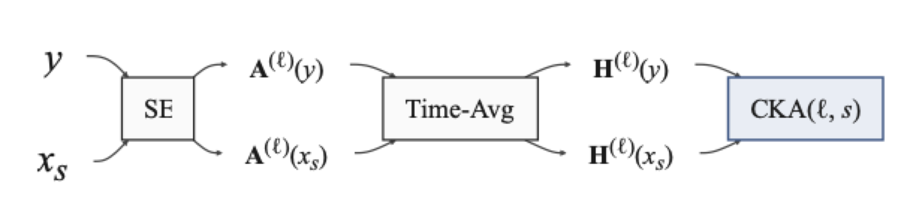

<div align="center">

# SE-Probe

**Where do speech enhancement models adapt to degraded input, layer by layer?**

Probing code, data tables and an eight-chapter book for<br>
*Probing Layer-Wise Robustness and Sensitivity of Speech Enhancement Models Under Noise and Reverberation*<br>
Yair Amar, Amir Ivry, Israel Cohen · Technion · IEEE/ACM TASLP

[](https://arxiv.org/abs/2512.00482)
[](https://yairamar.github.io/SE-Probe/)
[](https://yairamar.github.io/seint-show-web/)
[](https://github.com/YairAmar/SE-Probe/actions/workflows/ci.yml)
[](LICENSE)



</div>

## The idea in one paragraph

A frozen enhancement model sees the same utterance clean and degraded. At every probed layer, the two activations are compared with linear CKA, and the curve of CKA against degradation level (SNR from −10 to 30 dB, or C50 from −5 to 25 dB) is summarised by a line: its intercept is the layer's **robustness**, its slope its **sensitivity**. Across MUSE, MP-SENet and Demucs, on additive noise and on reverberation, the profile is sharply organised by depth, absent in a randomly initialised network, and formed during fine-tuning. The book reproduces every number in the paper from the tables shipped in this repository.

## Try it

```bash
git clone https://github.com/YairAmar/SE-Probe.git && cd SE-Probe
pip install -e .            # add [models] for MP-SENet / Demucs, [metrics] for DNSMOS
python scripts/setup.py     # fetches the MUSE checkpoints and probes your device
jupyter lab notebooks/      # eight chapters, each runs on a laptop in seconds
```

```python
import pandas as pd
from se_probe import fit_profile, mean_level_curves, tradeoff_summary

df = pd.read_parquet("results_demo/cka_snr_muse_demo.parquet")
fit_profile(df, "muse")                          # alpha, beta, R², endpoints, AUC per probed layer
tradeoff_summary(mean_level_curves(df, "muse"))  # r(alpha, beta), saturation spread f, PC1, floor
```

## What is here

| | |
|---|---|
| `se_probe/` | CKA (biased and unbiased), activation extraction for the three models, per-layer profiles and saturation-spread statistics, hierarchical bootstrap, speaker-level quality association, diffusion maps |
| `notebooks/` | Eight chapters that follow the paper in order; every printed number is recomputed and asserted against the printed value |
| `results_tables/` | The 84 small tables behind every number, with SHA-256 manifest and provenance |
| `scripts/` | Resumable drivers that regenerate the sweeps (824 utterances × 41 SNRs × 18 noises, 13 C50 levels × 88 RIRs, six fine-tuning arms) and the analysis CLIs |
| `training/` | Dereverberation fine-tuning for MUSE, MP-SENet and Demucs, held-out evaluation, selective freezing |

Full module tour in `docs/architecture.md`; dataset and artifact layout in `data/README.md`.

## Paper and demo

- **Journal version:** *Probing Layer-Wise Robustness and Sensitivity of Speech Enhancement Models Under Noise and Reverberation*, IEEE/ACM Transactions on Audio, Speech, and Language Processing.
- **Preprint:** [arXiv:2512.00482](https://arxiv.org/abs/2512.00482), *Probing Layer-Wise Robustness and Sensitivity of Speech Enhancement Models* (v3, September 2026).
- **ICASSP 2026 Show & Tell, Barcelona:** an interactive version of this experiment. Pick an utterance, add noise, move the SNR slider and watch the per-layer CKA respond. [Live demo](https://yairamar.github.io/seint-show-web/) · [demo source](https://github.com/YairAmar/seint-show).
- **Checkpoints and full data:** [`yairamr/SE-Probe-models`](https://huggingface.co/yairamr/SE-Probe-models) and [`yairamr/SE-Probe-data`](https://huggingface.co/datasets/yairamr/SE-Probe-data) on HuggingFace.

## Cite

```bibtex
@article{amar2026probing,
  title   = {Probing Layer-Wise Robustness and Sensitivity of Speech Enhancement Models Under Noise and Reverberation},
  author  = {Yair Amar and Amir Ivry and Israel Cohen},
  journal = {IEEE/ACM Transactions on Audio, Speech, and Language Processing},
  year    = {2026},
  note    = {arXiv:2512.00482}
}
```

MIT license. Questions and issues: <https://github.com/YairAmar/SE-Probe/issues>.
